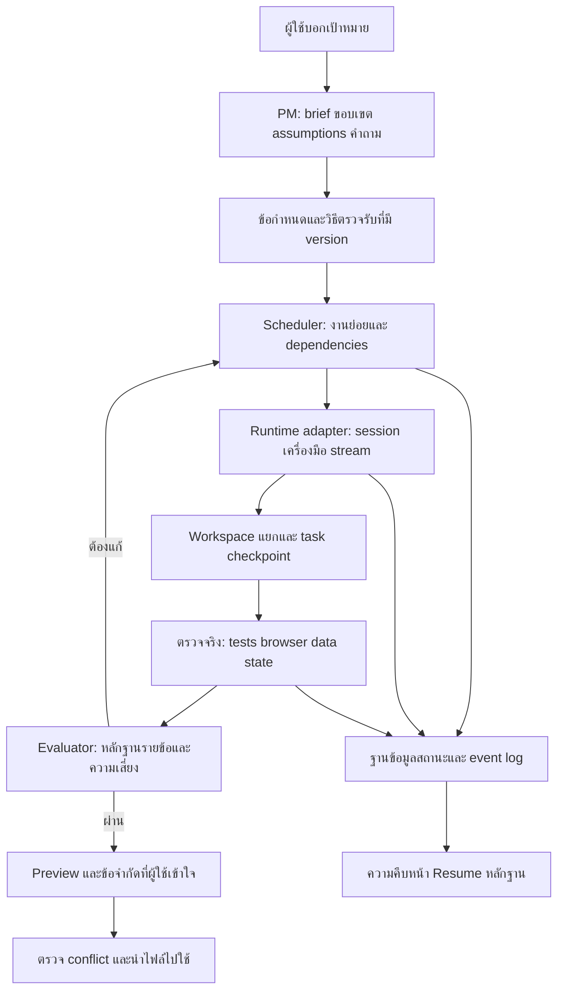

# Agent-PM: Deep research และแผนปรับระบบ coding agents

วันที่: 16 กันยายน 2026

## ความคืบหน้าการลงมือ — 17 กันยายน 2026

เริ่มชุด A แล้ว: persist checkpoint baseline และ hash ฝั่ง host, Resume ตรวจฐานเดิมและปฏิเสธ legacy ที่ไม่มีฐาน, Whisper เป็น persistent sprint inbox, ใช้ข้อกำหนดที่ขั้นถัดไปใน staging และ block delivery เมื่อยังมี pending, รักษา task DONE เมื่อหยุด, จำกัด excerpts ของ QA/second review, ห้าม code delivery เมื่อไม่มี test command ที่ผ่าน และแสดง automated-check scope กับ acceptance ที่ยังไม่ได้ตรวจรับอย่างอิสระ

Probe F02 หลังแก้: `conflict_blocked=true`, `human_edit_preserved=true` ข้อค้นพบด้านล่างเป็นหลักฐานก่อนแก้ ไม่ใช่รายการที่ยังเหลือทั้งหมด

การตรวจหลังลงมือ: backend suite 183 tests ผ่านก่อนเพิ่ม symlink regression อีกสองเคส, frontend build และ browser regression ของ Resume/error feedback/acceptance scope ผ่าน ใช้ browser fixtures ไม่ส่งงานให้ AI จริง เพิ่ม regression ใน `backend/tests/test_workflow_safety.py` สำหรับ human edits, ไฟล์ใหม่ของคน, manifest, workspace ผิด, Whisper, late instructions, task DONE, build-only delivery และ symlinks

ยังเหลือในชุด A: independent requirement-specific graders และ fault-injection coverage ครบถ้วน การมี test command ที่ผ่านไม่ใช่หลักฐานว่า feature ถูกทุกกรณี ส่วน runtime sandbox enforcement, session streaming, per-task Pause/Resume และ scheduler เป็นงานชุดถัดไป

## ข้อสรุป

Agent-PM มีพื้นฐานที่ใช้ต่อได้: เรียก coding runtime จริง, แยกโฟลเดอร์พักงาน, ตรวจ exit code, มี review gate, เก็บประวัติ และแสดงความคืบหน้า แต่ยังไม่พร้อมให้คนที่ไม่รู้โค้ดฝากงานใหญ่แล้วเชื่อผลลัพธ์ได้เอง

ข้อเสนอคือปรับระบบควบคุมงานให้ติดตาม **เป้าหมาย → งานย่อย → หลักฐาน → ผลลัพธ์ที่ผู้ใช้ลองได้** ใช้ coding agent หลักที่มีเครื่องมือจริง และเรียกผู้ช่วยเฉพาะเมื่อมีเหตุผล ไม่จำเป็นต้องเปิดทุกบทบาททุกครั้ง

การเพิ่ม prompt, skills หรือจำนวน agent อย่างเดียวไม่แก้การตรวจรับที่อ่อน การสูญเสียสถานะ และการส่งข้อมูลซ้ำจนเต็ม context

นี่เป็นรายงานวิจัยและข้อเสนอการออกแบบ ยังไม่ได้ติดตั้ง runtime ใหม่หรือทำ refactor ตามแผนด้านล่าง งานแก้ prompt และ UI ในรอบก่อนหน้าเป็นคนละส่วนกับข้อเสนอใหม่

## 1. ขอบเขตและหลักฐาน

ตรวจ Agent-PM โดยตรง: README, runner, orchestrator, process runner, workspace checkpoints, task/sprint models, planner contracts, verification, skills, websocket, Whisper, Resume และ UI ที่เกี่ยวข้อง

ตรวจเอกสารต้นทางของ Codex, Claude Code/Agent SDK, Google Antigravity และงานวิศวกรรมของ Anthropic รวมทั้งผล POS ที่ Agent-PM สร้าง ใช้ POS เป็นตัวอย่าง failure ของระบบ ไม่ใช่เป็นขอบเขตหลักของการปรับปรุง

สิ่งที่ทำจริง:

- ชุดทดสอบ Agent-PM: **172 passed**, 40 deprecation warnings, 32.52 วินาที
- ตรวจ CLI ที่ติดตั้ง: `agy 1.2.4`; help รองรับ `stream-json`, conversation ID, input streaming, model selection, JSON schema และ sandbox
- ตรวจ source ของเส้นทาง SDK และ CLI โดยไม่ส่งคำสั่งใหม่ไปโมเดล
- ทดลอง Resume conflict ใน temporary directory แยก ผลคือการแก้ของคนระหว่างพักงานถูกทับโดย checkpoint โดยไม่แจ้ง conflict
- POS รอบ `sprint-9be47ec8` เป็น COMPLETED และบันทึก `applied_to_project=true` มี 30 added files
- ผลตรวจ POS มี npm tests 26 tests, pytest 5 tests, typecheck และ build ผ่าน แต่ไม่ได้แปลว่า browser/iPad/live AI ผ่าน

สิ่งที่ยังไม่ได้ทำ: benchmark เปรียบเทียบโมเดลหลายค่ายแบบควบคุมตัวแปร, usability study กับคนไม่รู้โค้ด, iPad Safari จริง และ fault-injection ครบทั้งระบบ ข้อเสนอที่ยังไม่ทดลองระบุเป็นข้อเสนอ ไม่ใช่ผลวัด

## 2. บทเรียนจากเอกสารต้นทาง

### Coding agent ต้องมีวงจรรับหลักฐานแล้วทำต่อ

Claude Code อธิบายวงจรรวบรวม context, ลงมือด้วยเครื่องมือ และตรวจผล วงจรนี้ทำงานหลายรอบตามผลที่พบ ข้อเสนอสำหรับ Agent-PM คือให้ runtime ที่มีอยู่ทำวงจรดังกล่าว และให้ตัวควบคุมติดตามสถานะกับหลักฐาน อย่าสรุปความสามารถว่าเป็นเพียงการเรียก LLM ครั้งเดียว: ภายใน CLI ปัจจุบันใช้เครื่องมือได้จริงอยู่แล้ว แต่ Agent-PM มองเห็นรายละเอียดของวงจรนั้นน้อย [How Claude Code works](https://code.claude.com/docs/en/how-claude-code-works)

### มีทางแก้เรื่องความคืบหน้าที่ runtime รองรับอยู่แล้ว

Antigravity headless รองรับ NDJSON events สำหรับข้อความ เครื่องมือ usage และผลสุดท้าย พร้อม conversation ID และการคุยหลาย turn ขณะที่ Agent-PM ใช้ JSON ก้อนสุดท้ายกับ `communicate()` จึงแสดงได้หลัก ๆ ว่ารอมากี่วินาที ใช้ event stream ที่มีอยู่ก่อนสร้างระบบเลียนแบบความคืบหน้าเอง [Antigravity headless](https://www.antigravity.google/docs/cli/headless/)

### Resume ความจำกับ Resume ไฟล์เป็นคนละเรื่อง

Antigravity เลือก conversation เฉพาะ ID ได้; Claude SDK มี session resume และแยก session fork ออกจาก file checkpoint การออกแบบของเราต้องเก็บทั้งสถานะงาน ไฟล์ และ runtime session เพราะการมีโฟลเดอร์พักอย่างเดียวไม่รับประกันว่าทำต่อได้ และ session เดิมไม่ได้ป้องกันการทับไฟล์ [Antigravity Resume](https://www.antigravity.google/docs/cli/commands/resume/), [Claude SDK sessions](https://code.claude.com/docs/en/agent-sdk/sessions)

### Multi-agent ใช้เมื่อแยกงานได้จริง

Codex แนะนำให้เริ่ม parallel จากงานอ่าน เช่น exploration และ triage และระวังการเขียนไฟล์พร้อมกัน Anthropic ชี้ว่างาน coding จำนวนมากมี dependency มากกว่างาน research ผลวิจัย research จึงไม่ใช่หลักฐานว่าจะเพิ่มคุณภาพ coding ได้เท่ากัน ข้อเสนอคือขนานงานอ่านได้ และใช้ single writer หรือ workspace แยกสำหรับงานเขียน [Codex subagents](https://learn.chatgpt.com/docs/agent-configuration/subagents), [Multi-agent research system](https://www.anthropic.com/engineering/multi-agent-research-system)

### Planner และ evaluator สำคัญ แต่จำนวนขั้นควรปรับตามงาน

งาน long-running harness แสดงประโยชน์ของแผน งานทีละส่วน และ structured handoff งานศึกษารุ่นถัดมามี planner, generator, evaluator ที่ทดลองผ่าน browser และพบว่าบางองค์ประกอบลดได้เมื่อโมเดลเก่งขึ้น จึงไม่ควร hardcode ว่าทุกงานต้องมีจำนวน agent หรือ sprint เท่ากัน [Long-running agents](https://www.anthropic.com/engineering/effective-harnesses-for-long-running-agents), [Harness design](https://www.anthropic.com/engineering/harness-design-long-running-apps)

### ข้อมูลควรอ่านเมื่อจำเป็น และคุณภาพควรวัดซ้ำได้

Context engineering แนะนำให้ใช้ paths และ references เพื่ออ่านข้อมูลตามต้องการ ไม่ใส่ทุกอย่างเข้า prompt ส่วนเอกสาร evals แนะนำวัด workflow และเก็บ dataset จาก failure จริง ข้อเสนอของเราคือเก็บหลักฐานเต็มไว้ อ่านผ่าน artifact tools และวัดผลลัพธ์ที่ตรวจได้ แยกจาก tests ของตัว dashboard [Context engineering](https://www.anthropic.com/engineering/effective-context-engineering-for-ai-agents), [OpenAI agent evals](https://developers.openai.com/api/docs/guides/agent-evals), [Agent evaluation](https://www.anthropic.com/engineering/demystifying-evals-for-ai-agents)

## 3. ข้อค้นพบใน Agent-PM ปัจจุบัน

### F01 — P0: Whisper ข้าม staged workspace และไม่ได้ steer งานเดิม

หลักฐาน: [routes.py](../backend/app/api/routes.py#L831) เปิด background task ใหม่ เรียก `dispatch_agent_task` ด้วย `p.workspace_path` ของโปรเจกต์จริง ไม่ใช่ execution workspace ของ sprint

ผลกระทบ: ผู้ใช้คิดว่ากำลังแก้คำสั่งของ agent ตัวเดิม แต่เกิดงานแยกที่อาจเขียนไฟล์จริงและแข่งกับ sprint โดยไม่ผ่าน final gate ของรอบนั้น การ serialise writers ภายใน orchestrator จึงไม่ครอบคลุมทางนี้

แก้: เปลี่ยนเป็น persistent instruction inbox ผูก `run_id/task_id/revision`; runtime รับข้อความที่จุดปลอดภัย ถ้า runtime inject ไม่ได้ ให้จบ/interrupt แล้ว reconcile และ resume ห้ามเปิด writer บน original workspace เพื่อทำให้ดูเหมือน steer สำเร็จ

เกณฑ์ตรวจ: Whisper ขณะ coder ทำงานต้องไม่เปลี่ยน original; UI แสดง received/applied; ผลรอบงานสะท้อน constraint ใหม่

### F02 — P0: Resume อาจทับไฟล์ที่คนแก้ระหว่างหยุด

หลักฐาน: [workspace_session.py](../backend/app/services/workspace_session.py#L94) ตั้ง original baseline จากเวลาที่ Resume; [commit](../backend/app/services/workspace_session.py#L181) ตรวจ conflict เทียบฐานใหม่นี้ แทนฐานตอนเริ่มสร้าง checkpoint

ทดลองแล้ว: original=`initial`, staged=`agent edit`, พักงานแล้วคนเปลี่ยน original=`human edit`, Resume+commit สำเร็จและ original กลายเป็น `agent edit`

แก้: persist original manifest ตอนเริ่ม run และเก็บเนื้อหาฐานที่จำเป็นต่อ three-way merge; Resume ใช้ฐานเดิม ไม่สร้างใหม่เงียบ ๆ; ถ้ามีการแก้ซ้อน ให้ BLOCKED_CONFLICT หรือเสนอ merge ที่ตรวจได้ ต้องตรวจ additions, deletions และไฟล์ที่คนเพิ่มใหม่ด้วย

เกณฑ์ตรวจ: เคสข้างต้นต้องรักษา human edit และแจ้ง conflict การแก้ไฟล์คนละไฟล์ต้องไม่ถูกลบเพราะ checkpoint ไม่มีไฟล์นั้น

มี probe ที่ [checkpoint_conflict_probe.py](research/checkpoint_conflict_probe.py) ใช้เฉพาะ temporary directory ไม่แตะ POS

### F03 — P0: Tests ผ่าน + Reviewer อนุมัติยังไม่ผูกกับความต้องการจริง

หลักฐาน: [verification.py](../backend/app/services/verification.py#L163) เชื่อ exit code ของ checks ที่หาได้; [verdict parser](../backend/app/services/pipeline_contracts.py#L143) อ่าน verdict/findings/owners แต่ไม่มี requirement IDs หรือหลักฐานทดสอบรายข้อ

Counterexample: POS บอกว่าตัดสต็อกแบบ atomic แต่ `executeTransaction()` เพียง `await action(this)`; tests happy-path ผ่านและ Reviewer กล่าวว่าพร้อม production หน่วยทดสอบบางส่วนอ่าน string ใน source แทนทดสอบ UI

แก้: เก็บ acceptance criteria แบบมี ID และ verification method ตั้งแต่ก่อนลงมือ; required criterion ต้องมี PASS พร้อม evidence ของ source revision ปัจจุบัน; NOT_RUN/UNKNOWN ห้ามเปลี่ยนเป็น PASS ด้วยข้อความของโมเดล เพิ่ม rollback, duplicate submission และ browser reload tests สำหรับงานข้อมูล ไม่บังคับชุดเดียวกันกับทุกประเภทโปรเจกต์

เกณฑ์ตรวจ: seeded broken transaction ต้องไม่ผ่าน release gate แม้ build และ unit tests ที่ agent เขียนเองผ่าน

### F04 — P1: Task เท่ากับบทบาท ไม่ใช่ชิ้นงานที่ทำต่อได้

หลักฐาน: [planner contract](../backend/app/services/pipeline_contracts.py#L31) คืน roles กับ acceptance strings; [orchestrator](../backend/app/services/orchestrator.py#L475) สร้าง task หนึ่งรายการต่อ role; [TaskItem](../backend/app/models/schemas.py#L39) ไม่มี dependencies, attempts หรือ checkpoint ราย task

ผล: BackendDev รับงานใหญ่ก้อนเดียว การ retry และสรุปความคืบหน้าละเอียดทำได้ยาก

แก้: plan เป็น feature tasks ที่มี `depends_on`, scope, file ownership, required evidence และ attempt IDs ทีมเป็นวิธีเลือกคนทำ ไม่ใช่หน่วยของงาน ตัวอย่าง task คือ “บันทึกบิลและสต็อกให้สำเร็จหรือล้มเหลวพร้อมกัน” ไม่ใช่ “ทำ backend ทั้งหมด”

### F05 — P1: Resume ยังรัน planning ใหม่ และ stage selector ไม่แยก execution จริง

หลักฐาน: [orchestrator](../backend/app/services/orchestrator.py#L333) โหลด checkpoint แต่ยัง dispatch TechLead/Architect; ข้าม implementation ที่ [line 695](../backend/app/services/orchestrator.py#L695) แล้วเข้าวงจร QA จากต้น `resume_from` เป็น metadata มากกว่าจะเป็นตัวเลือกเส้นทางครบถ้วน

แก้: แยก admission ของ run ใหม่กับ resumed run; ใช้ plan/version เดิม; เริ่มจาก task ที่ขาด evidence ถ้าไฟล์ไม่เปลี่ยนและ QA evidence ยังตรง revision ก็ไม่ต้อง rerun planning ไม่จำเป็น การตรวจซ้ำอาจจำเป็นเมื่อ runtime/commands/source เปลี่ยน แต่ต้องบอกเหตุผล

### F06 — P1: ไม่เก็บ runtime session ID และไม่รู้รายละเอียดที่ CLI กำลังทำ

หลักฐาน: [agent_runner.py](../backend/app/services/agent_runner.py#L121) เรียก CLI ใหม่ด้วย JSON final; response คืนข้อความและ tokens แต่ไม่ persist conversation ID; [process_runner.py](../backend/app/services/process_runner.py) เก็บ stdout จน process จบ

แก้: provider adapter ที่ stream event และ persist session ID ต่อ task/role; explicit conversation IDs ห้ามใช้ “latest conversation ของ workspace” เมื่อมีหลาย agent เพราะอาจทำต่อผิดบทบาท Runtime ไม่มี session capability ต้องใช้ structured handoff และแจ้งว่าเป็นการสร้าง session ใหม่จากสถานะเดิม

### F07 — P1: เสี่ยง context overflow ยังมีหลายทาง

หลักฐาน: [prepare_prompt](../backend/app/services/agent_runner.py#L98) fail เมื่อรวม system/task เกิน budget; QA แนบ handoffs; second review ที่ [line 1095](../backend/app/services/orchestrator.py#L1095) แนบ prompt รอบแรกกับ updated diff เต็มอีกครั้ง

แก้: context assembler ร่วมทุก call ที่กัน budget สำหรับคำสั่งและ contracts; optional evidence เปลี่ยนเป็น artifact references; diff อ่านตามไฟล์; source rules ใหญ่ให้แยก scoped references; เมื่อ mandatory context ใส่ไม่พอให้ split task/รายงานข้อจำกัด ไม่ตัด instruction สำคัญเงียบ ๆ

### F08 — P1: Permission บางส่วนเป็นข้อความเตือน ไม่ใช่ขอบเขตที่บังคับได้

หลักฐาน: [prompt trace](../backend/app/services/prompt_builder.py#L188) ระบุ allowed_tools เป็น advisory; CLI writer ใช้ skip-permissions; SDK capabilities เป็นค่า default; staged folder ไม่ใช่ OS sandbox

แก้: แยก capability ที่ runtime บังคับได้จากคำแนะนำใน prompt ตรวจ prerequisite ก่อนเริ่มงาน และใช้ workspace/container sandbox ตาม provider ที่รองรับ privileged operations อยู่ใน host policy แยกต่างหาก อย่าแสดงว่า “จำกัดสิทธิ์แล้ว” ถ้าทำได้แค่เขียน instruction

### F09 — P1: QA agent มองผลแบบอ่านอย่างเดียว แต่ไม่มีกลไกจัดหาการตรวจรับที่ขาด

หลักฐาน: prompt QA ให้ inspect ไม่แก้ไฟล์ แล้ว orchestrator รัน checks ที่พบ ไม่มี host-managed requirement-to-browser verification contract

แก้: แยก evaluator ที่เขียน/ขอ tests ในพื้นที่ verification แยกได้ และ runner ที่ทำงานตาม policy ใช้ test data แยก ไม่แก้ acceptance contract เพื่อทำให้ผ่าน สิทธิ์ read-only สำหรับ source code ไม่ควรหมายถึงห้ามทดสอบระบบจริงทั้งหมด

### F10 — P1: Pause/Cancel/Crash และสถานะ task ปะปนกัน

หลักฐาน: [models](../backend/app/models/schemas.py#L96) ใช้สถานะ sprint เป็น string; Stop เป็น FAILED; [finally](../backend/app/services/orchestrator.py#L1269) เปลี่ยนทุก task ใน run ที่ไม่ commit เป็น FAILED รวมถึงที่เคย DONE

มี cleanup ตอน restart อยู่แล้วที่ [state_store.py](../backend/app/services/state_store.py#L270) จึงไม่ได้ติด RUNNING ตลอด แต่ cleanup เปลี่ยน running เป็น cancelled/failed และ pending approvals เป็น rejected ไม่ใช่ recovery workflow

แก้: state machine ชัดเจน แยกผล task จากสถานะ delivery; INTERRUPTED ต้อง reconcile ก่อน resume; งาน verified ที่เสร็จแล้วไม่ถูกทำให้หายไปเพราะ run หยุดตอนอื่น

### F11 — P1: คนไม่รู้โค้ดยังต้องเข้าใจ Directive, consultation, roles และ gate

หลักฐาน: Console มีสอง mode และ role targeting, การส่ง directive ต้องเลือก explicit flow; การ์ด Resume ช่วยแล้วแต่ยังไม่มี product brief และ persistent questions ผูกกับ requirement

แก้: default “บอกสิ่งที่อยากได้” หนึ่งช่อง ให้ PM agent แปลงเป็น brief และแผน พร้อม assumptions ถามเฉพาะสิ่งที่กระทบผลลัพธ์ เช่น local/cloud, prototype/ขายจริง, ข้อมูลจริง/ตัวอย่าง ไม่บังคับเลือก framework, role หรือชื่อ skill

### F12 — P2: Observability และต้นทุนยังไม่พอประเมินความฉลาด

หลักฐาน: [websocket hub](../backend/app/api/websocket_hub.py#L17) broadcast สด ไม่มี raw event replay; มี console/log/summary persistence บางส่วน แต่ไม่ใช่ complete event log; runner effort เป็น env และ model implicit; token estimate บางเส้นทางอิงความยาวข้อความ

แก้: เก็บ event IDs, task/attempt/session IDs, model requested/reported, prompt/skill versions, measured usage แยก estimated usage และ error scope ต่อ run; replay จาก last event ID หลัง reconnect; วัด end-state success และ false completion ไม่ใช้จำนวน tests หรือ tokens เป็นคะแนนความฉลาด

## 4. โครงสร้างเป้าหมายที่เสนอ

### โมดูลและขอบเขต

- **PM/Planner:** เข้าใจเป้าหมาย สร้าง brief และ acceptance ไม่แก้ source
- **Coder:** อ่านและแก้ source ผ่าน mature coding runtime; งานเล็กใช้ coder เดียวได้
- **Specialists:** เรียกตาม task เช่น design/security/data เมื่อ scope ต้องใช้ ไม่เรียกทุกตัวเพื่อให้ดูมีทีม
- **Evaluator:** context แยกจาก coder เห็น requirement และ source/evidence; ไม่ถือคำรายงานของ coder เป็น proof
- **Scheduler:** เลือกงานที่พร้อม ล็อก ownership จำกัด retries และปรับแผนเมื่อพบปัญหา; ไม่ตัดสินว่าผ่านด้วย prose
- **Workspace/Delivery:** เก็บฐาน/checkpoints, merge/conflict, rollback และ delivery status
- **Host policy:** กำหนด permissions/budgets/approval; worker เปลี่ยนเกณฑ์ผ่านหรือเพิ่มสิทธิ์ตัวเองไม่ได้

### ข้อมูลหลักที่ต้องเพิ่ม

`ProductBrief`: goal, users, scope, non_goals, deployment_target, data_policy, assumptions, open_questions, revision

`Requirement`: id, observable_behavior, importance, verification_method, status, evidence_ids

`WorkTask`: id, requirement_ids, owner_role, depends_on, allowed_paths, status, attempt_id, source_revision, checkpoint_id

`TaskAttempt`: runtime, session_id, requested_model, reported_model, prompt_version, usage, interrupt_reason, result

`Checkpoint`: original_manifest, staged_manifest, parent_checkpoint, source_revision, verified_evidence_ids, created_at

`Evidence`: type, requirement_id, source_revision, command_or_steps, exit_code, artifact_paths, observed_result, provenance

`RunEvent`: monotonic_sequence, run_id, task_id, attempt_id, event_type, public_summary, payload_reference

Structured handoff เป็น reference และ next steps เก็บไว้ฝั่ง host; full logs เป็น artifact ที่อ่านได้ ไม่ใส่ซ้ำทุก prompt Acceptance/evidence ledger ที่ใช้ตัดสิน release ต้องไม่อยู่ในไฟล์ที่ coder แก้แล้วเปลี่ยน PASS ได้เอง

### Runtime adapters

เริ่มด้วย Antigravity CLI adapter ที่มีอยู่ เพิ่ม streaming/session support ก่อน การรองรับ Codex หรือ Claude เป็น adapter แยก ไม่ควรบังคับย้ายค่ายเพื่อแก้ปัญหาสถานะของ Agent-PM

สัญญาที่เสนอ: `start_task`, `stream_events`, `interrupt`, `resume_task`, `get_capabilities`; event types กลางประกอบด้วย MESSAGE, TOOL_STARTED, TOOL_FINISHED, USAGE, QUESTION, CHECKPOINT, RESULT, ERROR

ต้องมี compatibility probe ต่อ runtime version และจับ UNKNOWN_EVENT โดยไม่ crash เก็บ bounded raw record เพื่อวิเคราะห์ รายงาน capability ที่ไม่มีตรง ๆ เช่น steer_live=false แล้วใช้ interrupt+reconcile ไม่แกล้งทำสำเร็จ

Codex มี JSONL สำหรับ commands/file changes/tools และ schema ของผลลัพธ์; Claude SDK มีเครื่องมือ permission และ budget controls ใช้ตาม adapter ของแต่ละค่าย ไม่ถือ flag หรือ event shape ของค่ายหนึ่งว่าใช้กับอีกค่ายได้ [Codex non-interactive](https://learn.chatgpt.com/docs/non-interactive-mode), [Claude SDK agent loop](https://code.claude.com/docs/en/agent-sdk/agent-loop)

### Concurrency

เริ่ม single writer ต่อ integration workspace ส่วน explore/evaluate ที่ไม่เขียน source ทำขนานได้ ถ้าจะมีหลาย writers ใช้ workspace/worktree แยก ตรวจ merge และรัน integration tests อีกครั้ง อย่าเอา thread-safe queue มาอ้างว่าไฟล์ปลอดภัยจากการเขียนชนกัน

## 5. ประสบการณ์สำหรับคนที่ไม่รู้โค้ด

ตัวอย่างคำสั่ง: “อยากได้ POS ให้แม่ใช้บน iPad เก็บข้อมูลไว้ก่อน ยังไม่ใช้ cloud”

PM สรุปเป้าหมายและขอบเขตที่ตรวจได้ เช่น prototype local, ทำบิล/สต็อก/ส่งออกข้อมูลก่อน และถามกรณีที่สำคัญโดยใช้ภาษาธุรกิจ ไม่ตอบด้วยรายชื่อ framework ยาว ๆ หรือขยายงานเป็น analytics/production deployment โดยไม่ได้อยู่ในขอบเขต

สถานะที่ผู้ใช้เห็น:

- “กำลังทำการบันทึกบิลกับสต็อกให้ถูกต้อง”
- “บันทึกบิลได้แล้ว กำลังตรวจว่าถ้าเกิดข้อผิดพลาดข้อมูลจะย้อนกลับครบ”
- “ตรวจ 4 จาก 5 ข้อแล้ว ยังไม่ได้ทดสอบ Typhoon จริง”
- “พักงานระหว่าง task X, เก็บไฟล์แล้ว, ยังไม่นำเข้าโปรเจกต์”
- “พร้อมให้ลอง: เปิด Preview; สิ่งที่ทำได้; สิ่งที่ยังไม่ตรวจ; วิธีสำรองข้อมูล”

แยกผลสุดท้ายเป็น **ทำแล้ว / ตรวจแล้ว / ยังไม่ตรวจ / มีข้อจำกัด** ไม่แสดง “Production-ready” โดยอาศัย LLM verdict อย่างเดียว ไม่ใช้เปอร์เซ็นต์หรือ ETA ที่ไม่มีข้อมูลรองรับ

เอา role targeting, skills และ raw logs ไว้ใน Advanced; ไม่ตัดออกสำหรับผู้ใช้ที่ต้องการควบคุมเอง หน้าหลักเน้นเป้าหมายและผลลัพธ์

Artifacts ช่วยให้ตรวจแผน diff และ browser recordings ได้ แต่มี artifacts อย่างเดียวไม่ได้พิสูจน์ว่าผลงานถูกต้อง ต้องผูกกับ requirement และ revision [Antigravity artifacts](https://www.antigravity.google/docs/cli/artifacts/)

### Pause/Resume ที่ตรงพฤติกรรมจริง

Run states ที่เสนอ: READY → PLANNING → RUNNING → VERIFYING → REVIEWING → READY_TO_APPLY → COMPLETED

สถานะเพิ่มเติม: PAUSING, PAUSED, INTERRUPTED, WAITING_USER, BLOCKED, CANCELLED

Task states: PENDING, RUNNING, IMPLEMENTED, VERIFIED, BLOCKED, INTERRUPTED ไม่ทำ VERIFIED เป็น FAILED เพียงเพราะ delivery ยังไม่สำเร็จ

Pause แบบปกติให้ runtime จบจุดปลอดภัย snapshot แล้วค่อย PAUSED ถ้าจำเป็นต้อง kill process ให้ INTERRUPTED และตรวจไฟล์/task ที่ค้างก่อน resume ห้ามเรียกว่า “ทำต่อจากคำสั่งสุดท้ายพอดี” ถ้า runtime ไม่มี guarantee นั้น

Resume ตรวจ original manifest เดิม, artifact/session availability และ evidence freshness จากนั้นทำ task ที่ค้าง; งาน verified ไม่ต้องทำใหม่ถ้า source/dependencies ไม่เปลี่ยน Cancel ยกเลิก run แต่ checkpoints เก็บตาม retention policy; Start over เป็น run ใหม่ที่อธิบายขอบเขตชัดเจน

## 6. การวัดว่า agent ฉลาดขึ้นจริง

แยก **tests ของ Agent-PM** ออกจาก **evals ที่วัดงานซึ่ง Agent-PM สร้าง** 172 tests ที่ผ่านเป็นหลักฐานของระบบบางส่วน ไม่ใช่อัตราสำเร็จของ agent

เริ่ม dataset จาก failure ที่เกิดจริง แล้วขยายเป็น 20–30 representative tasks: คำสั่งไทยคลุมเครือ, repo ว่าง, repo เดิม, bug ที่ซ่อนอยู่, resume, whisper, dependency conflict, API/auth/network failure และ browser usability

เตรียม [eval design 26 เคส](research/agent-workflow-eval-cases.json) แล้ว ทุกเคสเป็น NOT_RUN และยังไม่ใช่ executable harness ต้องสร้าง fixtures/graders ก่อนใช้วัด baseline

ใช้ fixtures ที่รู้คำตอบและ graders ที่ตรวจ end state ไม่เทียบข้อความ final ตรง ๆ แยก LLM rubric สำหรับดีไซน์/ความเข้าใจง่ายออกจาก deterministic checks สำหรับข้อมูลและไฟล์

ตัวชี้วัด:

- Task success: acceptance ที่จำเป็นผ่านจริงกี่งาน
- False completion: บอกเสร็จหรือพร้อมใช้ทั้งที่ required criterion ขาด/ล้มเหลวกี่งาน
- Resume correctness: ไม่ทับ human edits, ไม่ทำ task verified ซ้ำโดยไม่มีเหตุผล
- Scope adherence: ไม่เพิ่มบริการหรือเปลี่ยนของนอกขอบเขต
- Recovery: auth/rate limit/timeout/tool failure ให้สถานะและทางแก้ถูกต้อง
- Usability: คนไม่รู้โค้ดเปิด preview และทำ user journey ได้หรือไม่
- Efficiency: measured tokens, wall time, tool calls, retries, คำถามที่ต้องตอบ; report distribution ไม่ซ่อน failure ด้วยค่าเฉลี่ย

เปรียบเทียบสามแบบบน tasks เดียวกันและ budget เดียวกัน: current pipeline, coder เดียว+verification, planner+coder+evaluator+specialists ตามจำเป็น จัด repeats สำหรับผล stochastic และรายงาน failed cases ไม่ใช้เดโมที่ดีที่สุดเป็นผลรวม

ยังไม่เลือก “โมเดลที่ดีที่สุด” โดยไม่มีผลวัด เก็บ requested/reported model และ capability ก่อน งานแก้รายงานหรือถามข้อมูลไม่จำเป็นต้องใช้ effort สูงเท่างานออกแบบที่ซับซ้อน เปลี่ยน routing/model ทีละตัวแปรและเก็บ baseline

Release gates ที่เสนอเป็นเงื่อนไขของโครงการ ไม่ใช่ benchmark ที่วัดแล้ว: critical safety/resume fixtures ต้องผ่านทั้งหมด, seeded broken app ต้องถูกปฏิเสธ, evidence ที่ไม่ตรง revision ต้องใช้ไม่ได้ และ pilot กับผู้ใช้ที่ไม่รู้โค้ดต้องทำ flow หลักได้

ดู trace เพื่อหาว่าพลาดตอนเลือกเครื่องมือ handoff หรือ gate จากนั้นใช้ dataset วัดซ้ำหลังเปลี่ยนระบบ [OpenAI trace grading](https://developers.openai.com/api/docs/guides/trace-grading)

## 7. แผนแก้เป็นชุดเดียวที่ตรวจรับได้

### ชุด A — ปิดช่องทางทับงานและผลลัพธ์เท็จก่อน

แก้ F01/F02/F03/F07/F10: instruction inbox, immutable baseline, retained task outcomes, bounded context ทุก call และ requirement evidence gate พร้อม regression fixtures จุดนี้ต้องมาก่อนเพิ่มจำนวน writers หรือ auto-run ที่ยาวขึ้น

ผลส่งมอบ: Whisper ไม่เขียน original, Resume conflict ไม่ทับไฟล์, second-review prompt ไม่ overflow กับ diff ใหญ่, task verified อยู่ครบ, missing evidence ไม่ผ่าน release

### ชุด B — เห็นงานจริงและทำต่อได้จริง

แยก runtime adapter ออกจาก `AgentRunner`; stream parser + bounded buffering + session IDs + version probes; persistent events/replay; session/checkpoint lifecycle; per-run runtime errors; explicit model/effort configuration

ผลส่งมอบ: UI เห็นว่าอ่าน/แก้/ตรวจอะไรจาก event จริง, disconnect กลับมาเห็นประวัติ, pause/interrupt/resume ของ task แยกกัน

### ชุด C — PM สำหรับคนไม่รู้โค้ดและ scheduler แบบงานย่อย

เพิ่ม ProductBrief/Requirements/Questions; task graph; single-writer integration; evaluator contracts; browser/test runner; Preview/Delivery UX ทำงานเล็กให้เรียบง่ายและงานใหญ่แบ่งตามสิ่งที่ตรวจได้

ผลส่งมอบ: ผู้ใช้ไม่ต้องเลือกทีมเอง; คำสั่งสั้นได้ขอบเขตที่ชัดและระบบที่ลองได้; required user decisions ไม่ถูกเดาเป็นคำอนุมัติ

### ชุด D — เลือก multi-agent และโมเดลจากผลวัด

ทำ eval harness จาก fixtures, baseline comparison, calibrated evaluator, budget/no-progress policy; เพิ่ม specialists และ adapters อื่นเมื่อผลวัดมีประโยชน์จริง

ผลส่งมอบ: รายงาน before/after มีทั้ง success, failures และต้นทุน รวมถึงเคสที่ coder เดียวคุ้มกว่า

### วิธี migration

ไม่ rewrite dashboard และ backend พร้อมกัน รักษา API เดิมเป็น compatibility layer เพิ่ม typed data/migrations แล้วเปลี่ยนเส้นทางผ่าน feature flag ต่อโปรเจกต์

Legacy checkpoints ที่ไม่มี original manifest ต้องระบุ untrusted baseline และเปิดให้ตรวจ/กู้ไฟล์ ห้าม invent ฐานเดิมเพื่อทำ silent auto-commit New runs ใช้ manifest version ใหม่ตั้งแต่เริ่ม

แต่ละชุดต้องมี acceptance และ rollback ของการเปิดใช้ ฟีเจอร์ที่ UI ยังไม่รองรับจริงต้องไม่โฆษณาว่าใช้ได้ครบ “แก้ทีเดียว” ควรหมายถึงใช้แผนและสัญญาข้อมูลเดียวกัน ไม่ใช่ merge ก้อนใหญ่ที่หาต้นเหตุไม่ได้

## 8. สิ่งที่ไม่ควรทำตอนนี้

- ไม่เพิ่ม agent 10–20 ตัวเพื่อแก้ผลตรวจรับที่อ่อน
- ไม่ขยาย context budget อย่างเดียวแล้วแนบ logs/diff ซ้ำทุก turn
- ไม่ใช้ flag ข้าม permissions แทน workspace isolation
- ไม่ทำให้ reviewer มี prompt ยาวขึ้นแต่ยังไม่มี browser/evidence
- ไม่ตั้ง coverage percentage หรือ “tests ผ่านทั้งหมด” เป็นตัวแทนว่า feature ใช้ได้จริง
- ไม่บังคับผู้ใช้ที่ไม่รู้โค้ดเลือกฐานข้อมูล/framework เพื่อเริ่ม prototype
- ไม่รับประกันว่าจะแก้ครบทุกประเภทงานจากเดโมไม่กี่งาน

## คำตัดสิน

แนวทางที่ตรงเป้าหมายที่สุดคือ **Agent-PM เป็น PM และระบบควบคุมทีมที่มี coding runtime จริงอยู่ข้างใต้** รักษาพื้นฐานที่ทำงานได้ เพิ่มสถานะและหลักฐานที่เชื่อถือได้ และทำให้ผู้ใช้เห็นผลลัพธ์แทนการต้องจัดการ agent เอง

เริ่มจากชุด A ก่อน เพราะการเพิ่ม autonomy บนเส้นทางที่อาจทับ human edits หรืออนุมัติผลงานผิดจะเพิ่มปัญหา หลังมี baseline และ evals แล้วจึงตัดสินว่า model, single agent หรือ multi-agent แบบใดเหมาะกับงานแต่ละประเภท

## Implementation update — 2026-09-17

เพิ่มจาก safety ชุดแรก:

- AntigravityAdapter แยก provider invocation, NDJSON normalization, bounded concurrent stdout/stderr drain, process-group interrupt, exact session resume และ local version/capability probe
- execution_attempts ผูก sprint/role/task key/session, provider usage vs estimate และ interrupted recovery; ไม่ใช้ workspace-latest conversation
- SQLite event journal ลำดับเพิ่มขึ้น, retention 10,000, recent/reconnect replay, redaction, ไม่เก็บ raw tool arguments/output และไม่เปิด dialog เก่าซ้ำ
- Pause แยกจาก abort; incomplete tasks เป็น INTERRUPTED; checkpoint fingerprint ใช้ตัดสินการ reuse DONE writer; Resume กลาง implementation ตรวจ/reconcile partial files ก่อนเขียน
- ProductBrief revision, requirements, assumptions/out-of-scope และ blocking questions; autopilot ต้องรอคำตอบในกรณี blocking; approval ว่างไม่ผ่าน
- Feature task graph แบบ opt in มี dependency validation, requirement coverage, ownership guard, serial staged writes และ task-level history/reuse
- shared context assembler จำกัด supporting prose/logs และรักษา mandatory JSON/acceptance contracts
- final check evidence ผูก source revision; frozen original verification config; mapped acceptance statuses; stale/mutating checks block delivery; strict coverage gate เปิดผ่าน config
- checkpoint preview มีปุ่มใน Mission Hub, scope แยกจาก original, หยุด preview ก่อน Resume; subprocess group cleanup
- call/token budgets, executable local regression eval harness และ report แยกจาก model benchmark

การตรวจล่าสุด: backend suite 232 tests ผ่าน; local workflow regressions 125/125;
frontend build ผ่าน. รายงาน local
regression และ browser UI ให้ดูผลการรันที่แนบใน repo ไม่ถือเป็น model benchmark.

### ยังไม่ใช่ผลสำเร็จครบ roadmap

26 natural-language/model evals และ repeated comparison arms ยังไม่ครบ. มี grader
SQLite E05/E06/E08 ที่ calibrated ด้วย seeded bugs/reference และ live smoke E05
แบบ single coder ผ่าน 1 invocation (~49.9 วินาที, provider รายงาน 33,035 tokens)
โดยแก้ sales.py และตรวจ persisted rollback state จริง. Token stop threshold
20,000 เป็นการตรวจระหว่าง invocation จึงถูกเกินภายใน call นี้; ไม่ใช่ hard cap.
เก็บรอบล้มเหลวจาก model/effort conflict และ permission requests ไว้ด้วย.
E05 ผ่านเส้นทาง pipeline จริง TechLead → Architect → BackendDev → QATester →
Reviewer (5 invocations) และ planner/coder/evaluator (3 invocations).
E06 จ่ายซ้ำและ E08 concurrent stock sales ผ่าน single-coder รอบแรกด้วย.
ทุกผลเป็น disposable fixtures; ไม่ได้รันกับ POS หรือ live payment API.
เพดาน invocation/token ของ smoke arms ต่างกันและยังไม่มี stochastic repeats
จึงยังใช้ตัดสินความคุ้มค่าหรือคุณภาพระหว่าง arms ไม่ได้.
ยังไม่มี before/after model success/cost ที่ทำซ้ำ, live provider matrix หรือ
การทดลองกับผู้ใช้ที่ไม่รู้โค้ดจริง. ยังไม่มี concurrent isolated worktree merge,
provider adapters นอก Antigravity, SDK session recovery parity และ OS sandbox
สำหรับ host verification ทุกแพลตฟอร์ม. CLI sandbox/permission behavior เป็น
provider responsibility; allowed_tools ของ skill ยัง advisory. โหมด host-proposals
เป็น default ใหม่: host แนบ bounded complete-file context, agent เสนอ JSON,
backend ตรวจ path/symlink/duplicate/unchanged baseline และเขียน staged files.
ไม่แทนที่ไฟล์เดิมที่ไม่ได้แนบใน context และยังไม่รองรับการลบไฟล์.
ไม่ใช่ OS sandbox หรือ adversarially sealed evaluation. ไม่ประกาศว่า
agent ฉลาดเทียบเท่า Codex/Claude Code หรือพร้อม production จาก unit tests.

ข้อจำกัด permission ของ headless เป็นเหตุผลที่ต้องแยก host writer; ไม่เพิ่ม
global always-proceed หรือ skip-all permissions. การตั้งค่า CLI ที่เกี่ยวข้อง
อธิบายไว้ใน [Antigravity settings](https://www.antigravity.google/docs/cli/settings/).
รายงาน live smoke: [ผล E05 host context](research/live-coding-host-context-result.json),
[ผล direct file tool ที่ถูกบล็อก](research/live-coding-file-tools-result.json).
ผลเพิ่มเติม: [multi-agent pipeline](research/live-coding-pipeline-result.json),
[planner/coder/evaluator](research/live-coding-planner-evaluator-result.json),
[duplicate/concurrent sales](research/live-coding-data-integrity-result.json).

Preview start/stop มี lock ต่อ project เพื่อป้องกัน process ซ้ำ, checkpoint
preview ไม่เริ่มเมื่อมี active queue และ backend shutdown ปิด preview groups.
Host proposal response ไม่สตรีมเนื้อหาไฟล์ลง activity feed; แสดง progress และ
paths ที่ host เขียนจริง. Failed proposals ยังเก็บ provider token usage/session
เมื่อมีรายงาน และไม่ถือเป็นการส่งมอบสำเร็จ.

## Agent playbook review update — 2026-09-17

ปรับ SYSTEM และ playbooks ทุก role ให้เคารพ invocation output contract,
host-run checks และ evidence ตาม source revision. Host writer รับ handoff
ภายใน JSON และ backend แปลงส่งต่อหลังตรวจ proposal โดยไม่รับชื่อไฟล์ที่
โมเดลอ้างแทน paths ที่ host เขียนจริง. Audit/debug default เป็น read-only;
เพิ่ม alias SecurityAuditor/MLDataEngineer ให้โหลด core playbook ถูกตัว.
ลด decorative reporting, unconditional build/training และมาตรฐานที่ขัด
กับ conventions ของแต่ละโปรเจกต์. แยก mock download fixture ออกจาก catalog
จริงและให้ test ดาวน์โหลดลง temporary stock directory.

ตรวจ prompt composition 12 roles และ backend regression 229 tests ผ่าน.
รอบนี้ไม่ได้เรียกโมเดลจริงซ้ำ; live fixture artifacts ข้างต้นเป็นผลก่อน
การปรับ playbooks รอบนี้ ไม่ใช่หลักฐานวัดคุณภาพหลังเปลี่ยน prompt.

## Automatic skill retrieval update — 2026-09-17

พบ Auto เลือกเพียง 2 skills ก่อนตัด role playbooks ที่ซ้ำออก จึงโหลด methodology
จากคลังได้น้อย. แก้ให้ตัด core roles ก่อนจัด slots, ใช้ Thai/English outcome
terms และ stack/acceptance context, ให้ direct triggers มาก่อน expanded terms
และลดการเลือกจาก generic words/role affinity เพียงอย่างเดียว. Auto เลือกได้
สูงสุด 4 operational skills ตามค่า default ภายใต้ excerpt budget เดิม.
Pinned skills ใช้ร่วมกับ Auto; Add/Assign ไม่เปลี่ยนเป็น Manual โดยอัตโนมัติ.
Manual ยังใช้เฉพาะ equipped list. มีปุ่มเปิด Auto ทั้งทีมและ catalog ตาม project.
Prompt Preview แสดง operational skills ที่โหลดจริงพร้อม selection reasons.

ทดสอบ deterministic Thai retrieval, Auto+pins/Manual isolation และ project
catalog: backend 232 tests และ frontend build ผ่าน. การโหลด MD เข้า prompt
ไม่ได้ยืนยันว่าโมเดลทำทุกขั้นใน skill; รอบนี้ไม่ได้เรียกโมเดลจริงซ้ำ.
