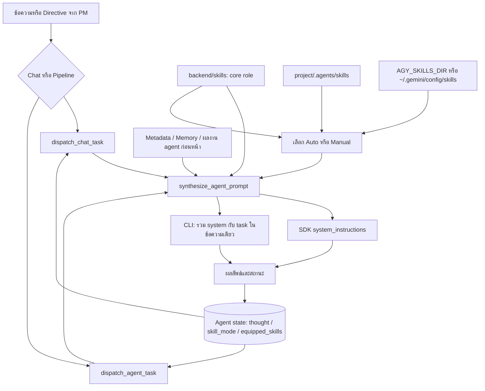

# Review ระบบ Prompt, System Instruction และ Agent Skills

วันที่ตรวจ: 16 กันยายน 2026

## สถานะหลังแก้

ข้อค้นพบด้านล่างบันทึกพฤติกรรมก่อนแก้ ขณะนี้เพิ่ม stable persona พร้อม migration, prompt builder ร่วมสำหรับ chat/task/preview, Manual แบบไม่ fallback, parser validation และ source provenance, core เฉพาะ Designer/DocWriter/Reviewer, execution-mode precedence, root AGENTS.md และ Markdown references, structured handoff, context budget และหน้า preview/trace ใน Team & Skills แล้ว

ข้อจำกัดที่ยังต้องแยกให้ชัด: allowed_tools เป็น metadata ของ skill ไม่ใช่ runtime permission; Auto ใช้ keyword/trigger ที่รองรับไทยและลำดับตัดสินคะแนนคงที่ ยังไม่ใช่ semantic retrieval; nested AGENTS.md ต้องอ่านตาม scope ก่อนแก้ไฟล์; persona เก่าที่เสียไปกู้จากชื่อได้เพียงค่าเริ่มต้น; trace บันทึกการประกอบ prompt ไม่ใช่หลักฐานว่าโมเดลใช้ skill จริงหรือทดสอบผ่าน คุณภาพผลลัพธ์จาก AI จริงยังต้องประเมินด้วยงานตัวแทน

## สรุป

ระบบมี core role playbook, skill แบบ Auto/Manual, project context และการส่งต่องานระหว่าง agent แล้ว แต่มีจุดที่ทำให้คำสั่งขัดกันและ persona ไม่คงที่ การแก้เฉพาะข้อความใน SKILL.md ยังไม่เพียงพอ ควรแก้การประกอบ prompt และแยกข้อมูลตัวตนออกจากข้อความสถานะก่อน

ขอบเขต: ตรวจ source ของ runner, skill manager, orchestrator, API, state store, frontend และ stock SKILL.md; ใช้โฟลเดอร์ชั่วคราวและ fake CLI เพื่อพิสูจน์พฤติกรรม ไม่เรียก AI ภายนอก ไม่แก้ข้อมูล POS ไม่เปลี่ยน runtime ในรอบ review นี้

## เส้นทางปัจจุบัน

Core role ใช้ stock เท่านั้น ส่วน operational skill มีลำดับ project > AGY > stock ตามการค้นหาไฟล์ การประกอบ prompt ปัจจุบันเป็นการต่อข้อความทั้งหมด ไม่มีการกำหนดสัดส่วน 80/20 หรือจำกัดงบบริบทจริง

## ข้อค้นพบที่ควรแก้ก่อน

### 1. สูง — Custom persona ใช้ข้อความสถานะที่เปลี่ยนตลอด

- `backend/app/services/state_store.py:444` เก็บ description ของ custom agent ใน `thought` และ title ใน `skill_title` โดยไม่มีช่อง persona แยก
- `backend/app/services/agent_runner.py:233` อ่าน `thought` เป็น persona แต่ progress และ skill activation สามารถเขียนทับ thought ก่อนอ่านได้
- `backend/app/services/orchestrator.py:651` แทรก persona จาก agent snapshot อีกชุด จึงมีโอกาสส่ง persona สองข้อความที่ไม่ตรงกัน
- เส้นทาง chat ไม่เพิ่ม custom persona แบบเดียวกับ task

หลักฐานจำลอง: สร้าง agent ด้วย `PERSONA_SENTINEL` แล้วเปลี่ยน thought เป็น `STATUS_SENTINEL`; task ส่ง `Specialist Persona: STATUS_SENTINEL` และไม่มี persona เดิม ส่วน chat ไม่มี persona เดิมเช่นกัน

ผลกระทบ: specialist ทำงานด้วยตัวตนไม่คงที่ การรันซ้ำอาจเหลือเพียงข้อความว่างานก่อนหน้าเสร็จแล้ว และการคุยกับ agent ให้พฤติกรรมต่างจากสั่งงาน

แนวแก้: เพิ่มข้อมูลถาวร `display_name` และ `persona` ใน schema/DB; ใช้ thought เฉพาะสถานะ; ให้ chat และ task เรียก prompt builder เดียวกัน สำหรับข้อมูลเก่าที่ถูกเขียนทับแล้วควรใช้ persona สำรองที่ระบุชัดว่า inferred และเปิดให้ผู้ใช้แก้

### 2. สูง — Manual ไม่รักษาการเลือกของผู้ใช้เมื่อรายการว่าง

- `backend/app/services/agent_runner.py:204` และ `:395` โหลด Manual แต่ใช้ `if not active_skills` เรียก Auto ต่อ
- การ fallback ไป `skill_name` เมื่อ `equipped_skills` ว่างอาจโหลด skill เก่ากลับมา
- `backend/app/api/routes.py:1130` เปลี่ยนเป็น Auto เมื่อถอด skill สุดท้าย และไม่ได้ล้าง legacy skill_name
- `get_skill` สร้าง playbook สำรองให้ชื่อที่ไม่มีไฟล์ ทำให้ skill ที่หายไปดูเหมือนโหลดสำเร็จ

หลักฐานจำลอง: Manual พร้อม equipped_skills ว่างเลือก `systematic-debugger` และ `backend-dev` เองจากข้อความงาน

แนวแก้: แยก branch ตาม mode โดยตรง; Manual ว่างใช้ core เท่านั้น; ถอด skill แล้วรักษา mode; migrate legacy selection อย่างชัดเจน; operational skill ที่ไม่พบต้องรายงานว่า missing แทนสร้าง skill เสมือน

### 3. สูง — คำสั่งวิธีทำงานขัดกับสิทธิ์ของขั้นตอน

- `backend/app/services/agent_runner.py:285` กำหนด Designer/QA/Reviewer เป็น read-only
- QA SKILL.md สั่งให้เขียน tests และ execute test commands แต่ `_run_cli(chat=True)` ห้าม terminal/RunCommand ขณะที่ orchestrator สั่ง QA วิเคราะห์และให้ระบบตรวจจริงภายหลัง
- `backend/app/services/agent_runner.py:346` ยังใส่ข้อความ `Implement using workspace tools` ใน prompt ของทุก role รวมถึง planning
- `allowed_tools` ถูกอ่านและแสดงใน UI แต่ source ที่ตรวจไม่ใช้รายการนี้จำกัด SDK capabilities หรือ CLI tools
- TechLead playbook สั่ง dispatch และขอ approval แม้ในขั้น triage agent ไม่มี API สำหรับทำสิ่งนั้นโดยตรง; ขั้นตอนจริงอยู่ใน orchestrator

ผลกระทบ: agent อาจเสีย turn ไปพยายามใช้เครื่องมือที่ไม่อนุญาต สร้างคำตอบที่คลุมเครือ หรือรายงานว่าจะทำกระบวนการที่ระบบไม่ได้ให้ทำ

แนวแก้: ระบุ execution mode แยกจาก role เช่น consultation / planning / implementation / verification-analysis / review; ให้ข้อจำกัดของ mode มีลำดับสูงกว่า playbook; QA วิเคราะห์หลักฐาน ส่วนคำสั่งทดสอบและผลจริงส่งจาก orchestrator; ข้อความ implementation ใช้เฉพาะ agent ที่แก้ไฟล์ได้ รายการ allowed_tools ต้องแสดงตามข้อจำกัดที่ runtime รองรับจริงและระบุเมื่อเป็นเพียงคำแนะนำ

### 4. กลาง — Editor และ core playbook มีความหมายไม่ตรงกัน

- API editor ที่ `backend/app/api/routes.py:978` อ่าน skill ด้วย project override
- runner ใช้ `get_base_role_skill` ที่ `backend/app/services/skill_manager.py:175` ซึ่งอ่าน stock เท่านั้น นี่สอดคล้องกับ spec เรื่อง core ถาวร แต่ UI ไม่แยก core กับ project extension ให้ชัด
- Project override มีผลเมื่อถูกเลือกเป็น active skill จึงไม่ได้หายทั้งหมด แต่ไม่ใช่การแทน core
- Auto อาจเลือก skill ตัวเดียวกับ core ทำให้เนื้อหา stock ซ้ำสองครั้ง; เมื่อเป็น project override ที่ขัดกับ stock จะมีสองชุดคำสั่งและท้าย prompt สั่งให้ทำตาม core อย่างเคร่งครัด
- ข้อความ `80% Curated Stock ... + 20% Injected Project Context` ใน `frontend/src/components/FocusRoomView.jsx:1491` ไม่มีการวัดหรือจัดสรรจริง

หลักฐานจำลอง: editor อ่าน PROJECT_OVERRIDE_SENTINEL ได้ แต่ core ไม่มี sentinel; เมื่อ active skill เป็น core เดียวกัน body ถูกใส่สองครั้ง

แนวแก้: แสดง Core Role, Project Rules และ Operational Skills แยกกัน; กำหนดว่า project rules เพิ่มหรือแทนอะไรได้; ตัดเนื้อหาซ้ำตามแหล่งไฟล์/เวอร์ชัน โดยคง project extension ที่มีเนื้อหาต่างจาก core; แทนข้อความ 80/20 ด้วยข้อมูลบริบทที่โหลดจริง

### 5. กลาง — Role บางตัวใช้ core ที่ไม่ตรงงาน

`ROLE_ALIAS_MAP` ให้ Designer → frontend-dev, DocWriter → architect และ Reviewer → security-auditor

ผลกระทบ: Designer มีมาตรฐาน implementation, DocWriter เน้นออกแบบระบบ และ Reviewer เน้น security มากกว่าความถูกต้องตาม acceptance criteria และคุณภาพ diff โดยรวม แม้ task prompt จะช่วยชดเชยบางส่วน

แนวแก้: เพิ่ม stock playbook เฉพาะ designer, doc-writer และ reviewer; security audit เป็น operational skill ของ reviewer; แต่ละ role มีผลลัพธ์ส่งต่อที่เหมาะกับงานจริง

### 6. กลาง — Skill parser รับ metadata ที่ผิดรูปแบบโดยไม่ตรวจ

- `backend/app/services/skill_manager.py:118` รองรับ `allowed_tools` แต่ไม่รองรับ `allowed-tools`
- ไม่ตรวจชนิด name/title/description/triggers/allowed_tools หลัง YAML parsing
- tier เชื่อ frontmatter ทำให้ไฟล์ project ที่ระบุ tier: stock ถูกรายงานเป็น stock และเสียคะแนน priority
- malformed YAML บางกรณีถูกกลืนแล้วใช้ metadata ว่าง ทำให้ผู้ใช้ไม่รู้ว่าคำสั่งส่วน metadata ไม่ได้โหลด

หลักฐานจำลอง: `triggers: [17]` ทำให้ matcher ล้มด้วย AttributeError; `allowed-tools: [read_file]` ได้รายการว่าง; ไฟล์ project ที่ประกาศ tier: stock ถูกรายงานเป็น stock

แนวแก้: validate schema ตอน save/download และตอน discovery ของไฟล์ที่แก้จากภายนอก; รองรับ alias ของชื่อ field; tier/source มาจากตำแหน่งไฟล์; skill ผิดรูปแบบต้องมี diagnostic ที่ระบุ path และไม่ทำให้ task ทั้งหมดล้ม

### 7. กลาง — บริบทส่งซ้ำและบางส่วนถูกตัดแบบไม่รู้โครงสร้าง

- `backend/app/services/skill_manager.py:302` ต่อ core, skill และ shared context ทั้งก้อน
- Architect plan และ backend output ถูกส่งทั้งใน system context และ task prompt หลายขั้น
- orchestrator ตัด response ด้วยจำนวนตัวอักษร เช่น QA ที่ `:823` และ Reviewer ที่ `:1002` อาจตัด contract หรือหลักฐานที่อยู่ท้ายคำตอบ
- synthesizer ไม่อ่าน specialist_specs, frontend_specs, execution_plan หรือ acceptance_criteria โดยตรง; บางขั้นชดเชยใน task prompt แล้ว จึงไม่ใช่การตกหล่นทุกครั้ง แต่เส้นทางที่เรียก builder อย่างเดียวไม่ได้ข้อมูลครบ

แนวแก้: ทำ handoff แบบมีฟิลด์ summary / changed_files / contracts / checks / risks / next_owner และ validate; ส่งแต่ละข้อมูลครั้งเดียว; acceptance criteria และคำสั่งล่าสุดห้ามถูกตัด; ใช้งบบริบทและสรุปตามส่วนแทน slice แบบตัดกลางข้อความ

## จุดปรับปรุงเพิ่มเติม

### Auto skill selection

`backend/app/services/skill_manager.py:249` tokenize ชื่อและ description ด้วยภาษาอังกฤษเป็นหลัก ภาษาไทยใช้ได้บางส่วนผ่าน trigger substring แต่ไม่ครอบคลุม semantic matching; trigger แบบ substring อาจจับคำสั้นในคำอื่น; project tier +2 ทำให้ skill ที่ไม่มีหลักฐานว่าตรงงานได้คะแนน; การเทียบ full task prompt อาจเลือกจากคำใน blueprint หรือ boilerplate มากกว่าจากงานจริง

ควรจัดอันดับจาก user intent + role + stage + stack, รองรับ trigger ไทย, ตรวจ boundary สำหรับคำอังกฤษ, ให้ priority เฉพาะ skill ที่มี relevance และใช้ลำดับตัดสินคะแนนเสมอที่คงที่

### Markdown และไฟล์อ้างอิง

App loader อ่านเฉพาะ body ของ SKILL.md ไม่มีขั้นตอนโหลด reference files, scripts หรือ project AGENTS.md เข้าสู่ prompt อย่างชัดเจน `project_path` ใน synthesizer ยังไม่ใช้โหลดกฎ Markdown อื่น การที่ CLI อ่านกฎ repository เองหรือไม่เป็นพฤติกรรมของ runtime ที่ต้องตรวจแยก ไม่ควรถือว่า SDK และ CLI เหมือนกัน

Skill จาก AGY อาจอ้าง `references/...` โดยไม่มี base path ในข้อความที่ส่ง และ runtime ถูกสั่งให้ทำงานใน workspace จึงไม่รับประกันว่าจะหาไฟล์อ้างอิงภายนอกเจอ

ควรโหลด project rules แบบมี scope, ติด source path ให้ skill, resolve reference อย่างมีขอบเขต, โหลดเฉพาะที่จำเป็น และรายงานไฟล์อ้างอิงที่ไม่พบ

### ความโปร่งใสของ agent

`active_skills` ปัจจุบันหมายถึงรายการที่เลือกและใส่ prompt ไม่ใช่หลักฐานว่า agent ใช้วิธีนั้นจริง การให้ตอบ `[Used Skill: ...]` ยังเป็น self-report

ควรมี prompt preview และ execution trace ที่แสดง role, persona, mode, core path, selected skill paths, เหตุผลการเลือก, hash/version, context sections, ข้อมูลที่ถูกตัด และผล check จาก process จริง แยก selected skills กับ reported used skills ให้ผู้ใช้เข้าใจตรงกัน

## ลำดับดำเนินการที่แนะนำ

1. แยก persona จาก thought และใช้ builder เดียวใน chat/task พร้อม migration
2. แก้ Manual semantics และตรวจ skill ที่ missing/invalid
3. รวม execution mode และแก้ข้อความที่ขัดกับสิทธิ์เครื่องมือ
4. แยก core/project rules/operational skills ใน API และ editor; เพิ่ม core ที่ตรงแต่ละ role
5. ทำ structured handoff, context budget และ project Markdown loading
6. เพิ่ม prompt preview/trace แล้ววัดคุณภาพด้วยงานตัวอย่างภาษาไทยและอังกฤษ

## เกณฑ์ตรวจหลังแก้

- Persona เหมือนเดิมหลัง progress, failure และ rerun; chat/task ใช้ตัวตนเดียวกัน
- Manual ว่างมี core อย่างเดียว; skill ที่ถอดไม่กลับมา; skill ที่หายหรือ metadata ผิดมี diagnostic
- Prompt ของ read-only role ไม่มีคำสั่ง implementation/เขียน tests/เรียก terminal ที่ mode ห้าม
- Project rules มีผลตรงตามสิ่งที่ editor แสดง; core ไม่ถูกใส่ซ้ำ
- Acceptance criteria และ API contract ครบใน handoff โดยไม่มีการตัดกลางข้อมูล
- Prompt trace แสดงสิ่งที่โหลดจริง และไม่บันทึก secret หรือเนื้อหาแนบเกินจำเป็น
- ทดสอบงานตัวแทน เช่น POS order/stock, UI loading/error และ QA failure recovery ด้วย workspace จำลอง; ใช้หลักฐานไฟล์และผลทดสอบเป็นคะแนนคุณภาพ

ข้อจำกัดของ review: ตรวจยืนยันพฤติกรรมการประกอบ prompt ด้วยข้อมูลจำลองแล้ว แต่ยังไม่ได้ทำการเปรียบเทียบคุณภาพคำตอบจากโมเดลจริง จึงยังไม่อ้างผลด้านความเร็ว ค่าใช้จ่าย หรือเปอร์เซ็นต์คุณภาพที่ดีขึ้น
