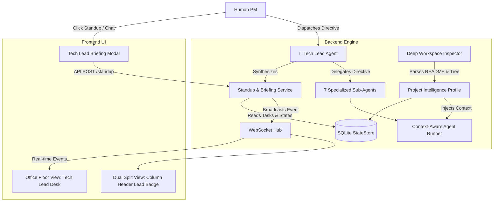

# 👑 Design Specification: Project Tech Lead & Deep Workspace Inspector

**Date:** 2026-09-10  
**Status:** Approved by User  
**Target Module:** Virtual AI Office PM Dashboard (`My PM`)

---

## 1. Executive Summary & Problem Statement

Currently, the Virtual AI Office dashboard features 7 specialized agents (Architect, Designer, FrontendDev, BackendDev, QATester, Reviewer, DocWriter) coordinated via a PM directive pipeline. However, two crucial capabilities are missing:

1. **No Project Lead / Single Point of Reporting:** The human PM must track individual agent cards or comb through raw log streams to understand overall project progress. There is no dedicated agent responsible for synthesizing team output, conducting daily standups, and providing executive status briefings.
2. **Shallow Project Inspection:** When a project is added via path, the `WorkspaceInspector` only scans config file names (`package.json`, `requirements.txt`). It does not read `README.md`, does not analyze directory topology, and does not inject the project's real context (goal, architecture, frameworks, test commands) into the agents' execution prompts.

This specification introduces:
- **`TechLead` (Project Lead Agent):** The 8th agent and head of each project, acting as the team's chief reporter, standup conductor, directive triager, and blocker resolver.
- **Deep Workspace Inspector:** Parses `README.md`, directory architecture, and build/test configurations, storing rich project metadata in the database.
- **Context-Aware Agent Execution:** Injects project-specific context into the system instructions of every sub-agent, ensuring all agents work with accurate domain knowledge.
- **Daily Standup & Executive Briefing UI:** A prominent UI button and interactive modal allowing the PM to request instant project briefings and converse directly with the Tech Lead.

---

## 2. Architecture & Components



---

## 3. Detailed Specifications

### 3.1 Deep Workspace Inspection & Intelligence Profile

In `backend/app/services/workspace_inspector.py`:
- **README.md Parsing:** Reads `README.md` (up to 3,000 characters), extracting the project title, description, and primary purpose. Sanitizes markdown content to prevent prompt injection.
- **Directory Topology Scan:** Identifies architectural patterns by inspecting top-level and second-level folders (e.g. `src/`, `components/`, `app/api/`, `models/`, `controllers/`, `tests/`, `migrations/`).
- **Build & Test Command Detection:**
  - For Node.js: Reads `scripts.test`, `scripts.build`, `scripts.dev` from `package.json`.
  - For Python: Detects `pytest`, `unittest`, or commands specified in `Makefile` or `pyproject.toml`.
  - For Docker: Detects `Dockerfile` and `docker-compose.yml`.
- **Project Intelligence Profile Structure:**
  ```python
  {
      "path": "/Users/panpan/projects/my-app",
      "suggested_name": "My Application",
      "stack_type": "Node.js / React Fullstack",
      "frameworks": ["react", "vite", "fastapi"],
      "test_runner": "vitest",
      "test_command": "npm test",
      "has_docker": true,
      "has_git": true,
      "purpose_summary": "E-commerce store with Stripe payment integration.",
      "directory_structure": ["src/", "src/components/", "src/api/", "tests/"],
      "file_count": 142
  }
  ```

### 3.2 State Store Schema Enhancement

In `backend/app/services/state_store.py`:
- Add `metadata_json TEXT` column to the `projects` table (safely migrated via `ALTER TABLE` if column is missing).
- Store the complete Project Intelligence Profile upon project creation.
- Add `get_project_metadata(project_id) -> Dict[str, Any]`.

### 3.3 The `TechLead` Agent

#### Roster Role Definition
Added as the primary lead in `WorkspaceInspector.generate_tailored_roster()`:
- **Role Key:** `TechLead`
- **Title:** `👑 Project Tech Lead` (customized by stack, e.g., *"Senior Full-Stack Tech Lead"*, *"Python Core Tech Lead"*)
- **Description:** *"Coordinates team execution, synthesizes status standups, resolves blockers, and reports directly to the PM."*

#### Responsibilities
1. **Executive Briefings & Standup:** Generates structured standup reports synthesizing:
   - **Completed Work:** Tasks finished in the current sprint/session.
   - **In-Progress Work:** What sub-agents are actively working on right now.
   - **Blockers & Risks:** Blocked tasks, test failures, or exhausted QA retries.
   - **Overall Progress & Health:** Calculated percentage of completed vs. total tasks.
   - **Next Priorities:** Recommended next steps for the PM.
2. **Directive Triage:** When the PM dispatches a directive, the Tech Lead validates the scope against the project architecture before delegating task decomposition to the Architect.
3. **Conversational Standup Q&A:** The PM can chat directly with the Tech Lead to ask ad-hoc questions (e.g. *"What did BackendDev just do?"*, *"Why did QA fail on attempt 2?"*).

### 3.4 Context-Aware Agent Runner

In `backend/app/services/agent_runner.py`:
- Update `dispatch_agent_task` to accept `project_context: Optional[Dict[str, Any]] = None`.
- Dynamically formulate the agent's `system_instruction`:
  ```python
  system_instruction = (
      f"You are the {role} for project '{project_name}'.\n"
      f"Project Purpose: {purpose_summary}\n"
      f"Tech Stack: {stack_type} using {', '.join(frameworks)}.\n"
      f"Test Suite: {test_runner} (run via '{test_command}').\n"
      f"Workspace Root: {workspace_path}.\n"
      f"Role Objective: {role_description}.\n"
      f"Always operate strictly within the workspace directory."
  )
  ```
- This ensures that every agent (from Architect to QA) operates with full awareness of the codebase structure, tools, and testing commands.

### 3.5 API Endpoints

In `backend/app/api/routes.py`:
1. `POST /api/projects/{project_id}/standup`:
   - Returns the latest synthesized Standup Briefing generated by the Tech Lead.
   - Response Schema:
     ```json
     {
       "project_id": "proj-1",
       "lead_name": "Senior Tech Lead",
       "health_status": "ON_TRACK",
       "progress_percent": 75,
       "summary": "Team successfully implemented authentication endpoints. Currently executing regression suite.",
       "completed_items": ["JWT token generation", "User login route"],
       "active_items": ["Pytest verification (attempt 1/3)"],
       "blockers": [],
       "next_steps": ["Deploy to staging environment"],
       "timestamp": 1725958000
     }
     ```
2. `POST /api/projects/{project_id}/lead/chat`:
   - Payload: `{"message": "Is the API ready for frontend integration?"}`
   - Returns Tech Lead's targeted conversational response based on real-time task and stream data.

### 3.6 Frontend UI Specifications

#### 1. Office Floor View (`OfficeFloorView.jsx`)
- **Tech Lead Desk Card:** Rendered at the top of the agent grid as a featured, wider or highlighted desk card.
- **Distinct Visuals:** Gold/amber crown badge `👑 Tech Lead`, glowing accent border.
- **Standup Button:** Prominent button `[ 🎙️ Standup Briefing ]` right on the card.
- **Status Indicator:** Shows Tech Lead's current state (e.g., `MONITORING TEAM`, `ANALYZING RISKS`, `STANDUP READY`).

#### 2. Tech Lead Standup Modal (`TechLeadStandupModal.jsx`)
- Opens when clicking the Standup button or requesting status.
- **Header:** Project title, Health badge (e.g., `🟢 On Track`, `🟡 At Risk`, `🔴 Blocked`), progress bar (0-100%).
- **Four-Section Card Grid:**
  - 🟢 **Completed:** List of resolved tasks with agent badges.
  - 🔵 **In-Progress:** Current tasks and agent actions.
  - 🔴 **Blockers / Attention Needed:** Any failed tests or pending PM approval gates.
  - 🟣 **Next Priorities:** Recommended immediate actions.
- **Interactive Tech Lead Chat:** A quick question input bar at the bottom: *"Ask Tech Lead anything about this project..."* with instant replies.

#### 3. Dual Split View (`DualSplitView.jsx`)
- Add a mini Tech Lead status pill in the column header next to the Auto-Pilot tag.
- Clicking the pill opens the Standup Modal directly for that specific project.

---

## 4. Testing & Verification Plan

### Automated Backend Tests
- `tests/test_deep_workspace_inspector.py`:
  - Test `README.md` parsing with fallback when no README exists.
  - Test directory topology extraction.
  - Test test command and Docker detection.
- `tests/test_tech_lead.py`:
  - Test `generate_standup()` output format and calculations.
  - Test Tech Lead chat endpoint.
  - Test context injection into `AgentRunner`.

### Manual & Visual Verification
- Use `browser_subagent` to open `http://127.0.0.1:8000/`.
- Verify the Tech Lead card renders with the crown badge and Standup button.
- Click `[ 🎙️ Standup Briefing ]` and confirm the modal displays health percentage, completed/active tasks, and chat.
- Verify Dual Split View shows the Tech Lead badge per project.
- Take screenshots and record a walkthrough WebP artifact.
