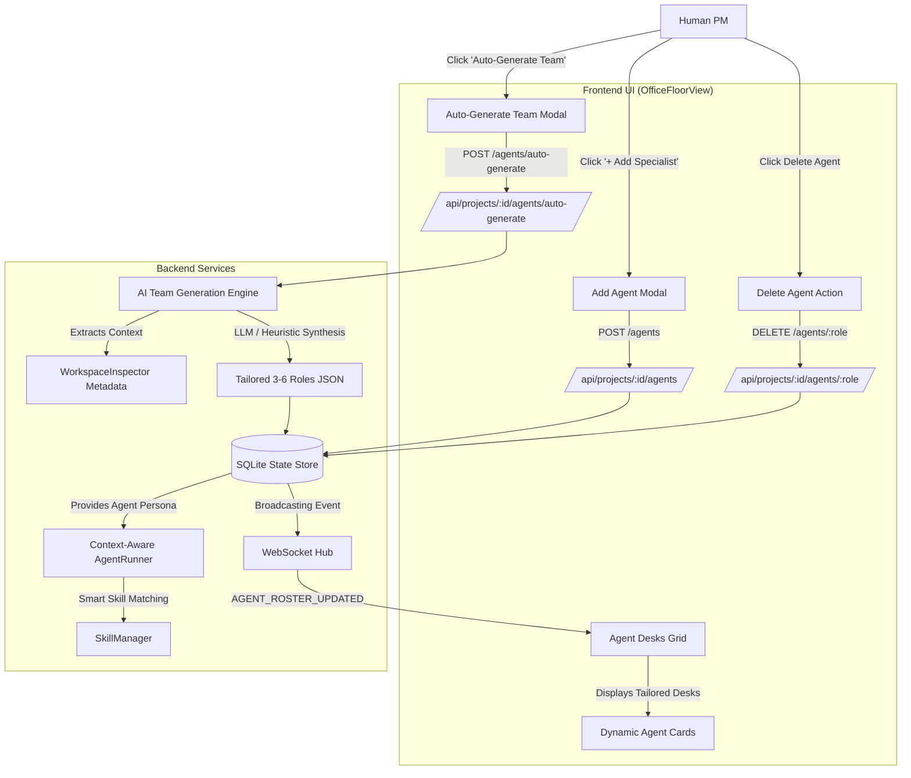

# 🤖 Design Specification: Project-Aligned AI Agent Generator & Custom Roster Management

**Date:** 2026-09-12  
**Status:** Approved by User  
**Target Module:** Virtual AI Office PM Dashboard (`Agent-PM`)

---

## 1. Executive Summary & Problem Statement

In the current Virtual AI Office PM dashboard, when a user adds a workspace, `WorkspaceInspector` assigns a general archetype roster (ML, Web, Python Backend, or General) using fixed enum roles (`Architect`, `Designer`, `FrontendDev`, `BackendDev`, `QATester`, etc.). 

While this provides initial roles, modern development projects have hyper-specialized requirements:
- A **3D WebGL / Game project** needs roles like `GamePhysicsEngineer`, `ThreeJsSceneArtist`, `AudioEngineSpecialist`, and `GameLoopDeveloper`.
- A **Security / Fintech API project** needs roles like `CryptoAuditor`, `OAuthSecurityEngineer`, `HighThroughputBackendDev`.
- An **AI / LLM project** needs roles like `PromptEngineer`, `RAGEvaluator`, `ModelInferenceSpecialist`.

Furthermore, human PMs currently cannot add, remove, or customize their agent workforce directly from the UI.

### Key Objectives
1. **AI Auto-Generate Team:** An intelligent service that analyzes the workspace context (`README.md`, dependencies, file topology, detected tech stack) and uses the Tech Lead LLM (with a resilient fallback engine) to generate 3–6 hyper-specialized agent roles tailored specifically to that project's domain.
2. **Custom Agent Management UI:**
   - **"🤖 Auto-Generate Team" Button & Modal:** Allows PMs to trigger AI team generation at any time with a preview of proposed roles, titles, and playbooks.
   - **"+ Add Specialist" Card & Modal:** Enables PMs to recruit custom agents with tailored roles, responsibilities, and assigned skills.
   - **Agent Removal:** Allows PMs to remove custom sub-agents directly from the office floor (preserving the Tech Lead as the team anchor).
3. **Dynamic Persona Execution in `AgentRunner`:** Ensures any custom role seamlessly inherits its description as its system persona prompt and dynamically leverages the Smart Skill Selection engine.

---

## 2. Architecture & Data Flow



---

## 3. Detailed Specifications

### 3.1 Backend Data Model & State Store

#### Schema Changes
In [`backend/app/models/schemas.py`](file:///e:/work/Agent-PM/backend/app/models/schemas.py):
- Add `CustomAgentCreateRequest`:
  ```python
  class CustomAgentCreateRequest(BaseModel):
      role: str = Field(..., min_length=2, max_length=50)
      title: str = Field(..., min_length=2, max_length=80)
      description: str = Field(..., min_length=5, max_length=300)
      skill_name: Optional[str] = None
      skill_tier: Optional[str] = "stock"
  ```
- Add `AutoGenerateRosterRequest`:
  ```python
  class AutoGenerateRosterRequest(BaseModel):
      replace_existing: bool = True
  ```

#### StateStore Methods
In [`backend/app/services/state_store.py`](file:///e:/work/Agent-PM/backend/app/services/state_store.py):
- `delete_agent(project_id: str, role: str) -> bool`:
  - Deletes row from `agent_states` where `project_id = ? AND role = ?`.
  - Guardrail: Prevent deleting `TechLead` (returns error or `False`).
- `add_agent(project_id: str, role: str, title: str, description: str, skill_name: Optional[str] = None, skill_tier: Optional[str] = "stock") -> AgentState`:
  - Inserts/updates `agent_states` with initial status `IDLE`, thought=description, and skill bindings.

---

### 3.2 AI Team Generation Engine

In [`backend/app/services/workspace_inspector.py`](file:///e:/work/Agent-PM/backend/app/services/workspace_inspector.py) & [`backend/app/services/tech_lead_service.py`](file:///e:/work/Agent-PM/backend/app/services/tech_lead_service.py):

#### AI Prompting Strategy
When `auto_generate_roster(project_id)` is invoked:
1. Gather project intelligence profile from `store.get_project_metadata(project_id)`:
   - Purpose summary from `README.md`
   - Tech stack & frameworks (`three`, `react`, `fastapi`, `torch`, `vitest`, etc.)
   - Top-level and second-level directory tree (e.g. `src/physics/`, `src/engine/`, `src/api/`)
2. Format LLM prompt for `TechLeadService`:
   ```text
   Analyze this software project and produce a tailored agile engineering team of 3 to 5 specialized sub-agents (excluding TechLead).
   Project Context:
   - Name: {name}
   - Stack: {stack}
   - Purpose: {purpose}
   - Frameworks: {frameworks}
   - Directories: {directories}

   Output MUST be valid JSON array with keys:
   [
     {
       "role": "PascalCaseIdentifier",
       "title": "Human Readable Title",
       "description": "Specific responsibility in this codebase",
       "skill_name": "suggested-skill-name"
     }
   ]
   ```
3. Run via `agy` CLI if available; if not or in test mode, trigger the **High-Precision Domain Heuristic Engine**:
   - **3D / Game Development (`three`, `babylon`, `phaser`):**
     - `GamePhysicsDev`: "Simulates vehicle dynamics, aerodynamics, and collisions"
     - `ThreeJsSceneArtist`: "Constructs 3D models, textures, lighting, and camera views"
     - `RaceLogicEngine`: "Manages race state, lap timing, AI competitors, and leaderboard"
     - `WebAudioDev`: "Implements engine sounds, collision audio, and ambient effects"
     - `QATester`: "Validates physics math, 60fps frame budgeting, and collision bounds"
   - **Machine Learning & AI:**
     - `MLEngineer`, `DataSystemsDev`, `ModelEvaluator`, `MLOpsDeployer`
   - **FastAPI / Microservices:**
     - `ApiSystemsDev`, `DatabaseArchitect`, `SecurityAuditor`, `PytestSpecialist`
   - **Modern Web App (React / Next.js / Vite):**
     - `FrontendUiDev`, `StateAndApiDev`, `PerformanceAuditor`, `VitestSpecialist`

---

### 3.3 Dynamic Agent Execution in `AgentRunner`

In [`backend/app/services/agent_runner.py`](file:///e:/work/Agent-PM/backend/app/services/agent_runner.py):
- When `dispatch_agent_task(role=...)` is called for any dynamic or custom role:
  - Retrieve the agent's state from `state_store.get_agent_status(project_id, role)`.
  - If `role` is not in static `ROLE_PROMPTS`, use the stored `thought` / description:
    `persona = agent_state.thought or f"You are a specialized {role} engineer."`
  - Pass the persona to the LLM / simulation instructions.
  - Automatically match and activate domain skills using `skill_manager.match_skills_for_task(role, prompt, workspace_path)`.

---

### 3.4 API Endpoints in `routes.py`

1. `POST /api/projects/{project_id}/agents/auto-generate`
   - Generates and applies a tailored roster.
   - Broadcasts `AGENT_ROSTER_UPDATED` WebSocket event.
   - Returns `{ "project_id": str, "agents": List[AgentState], "summary": str }`.
2. `POST /api/projects/{project_id}/agents`
   - Validates `role` alphanumeric string, `title`, `description`.
   - Creates agent in `state_store`.
   - Broadcasts `AGENT_STATE_UPDATE`.
   - Returns created `AgentState`.
3. `DELETE /api/projects/{project_id}/agents/{role}`
   - Rejects deletion if `role == "TechLead"`.
   - Deletes from `state_store`.
   - Broadcasts `AGENT_DELETED`.
   - Returns `{ "status": "DELETED", "role": role }`.

---

### 3.5 Frontend UI Implementation

#### In `frontend/src/components/OfficeFloorView.jsx`:
1. **Header Action:**
   - Add button `⚡ AI Team` next to `👑 Standup` and `Deep Dive`.
   - Clicking opens `AutoGenerateTeamModal`.
2. **Agent Desks Grid:**
   - Add a `+ Add Specialist` desk card at the end of the grid:
     - Dashed border, friendly icon, invites PM to recruit an agent.
   - On custom agent desk cards:
     - Show a small delete button `✕` on hover to remove agent.
     - Fallback icon resolution for non-stock roles using `ROLE_ICONS` with a default `Bot` / `Cpu` icon.
3. **Modals:**
   - `AddAgentModal.jsx`: Clean modal with fields for Role Slug, Title, Specialty Description, and Initial Playbook/Skill selection.
   - `AutoGenerateTeamModal.jsx`: Modal displaying AI analysis of the workspace, previewing generated specialists with their domain playbooks, and a "Apply to Project" confirmation button.

---

## 4. Verification & Testing Plan

### Automated Backend Tests
- `tests/test_custom_agents.py`:
  - `test_create_custom_agent`: Verify custom agent registration, DB storage, and retrieval.
  - `test_delete_custom_agent`: Verify deletion of custom agent and blocking deletion of `TechLead`.
  - `test_auto_generate_roster_heuristics`: Verify specialized agent generation for 3D/Game, ML, and FastAPI workspaces.
  - `test_agent_runner_custom_persona`: Verify `AgentRunner` properly executes tasks with custom role personas.
- All existing 85 unit tests must remain 100% passing.

### Frontend Verification
- Vite production build must compile with 0 errors (`npm run build`).
- UI styling follows dark/light theme tokens in `index.css`.
